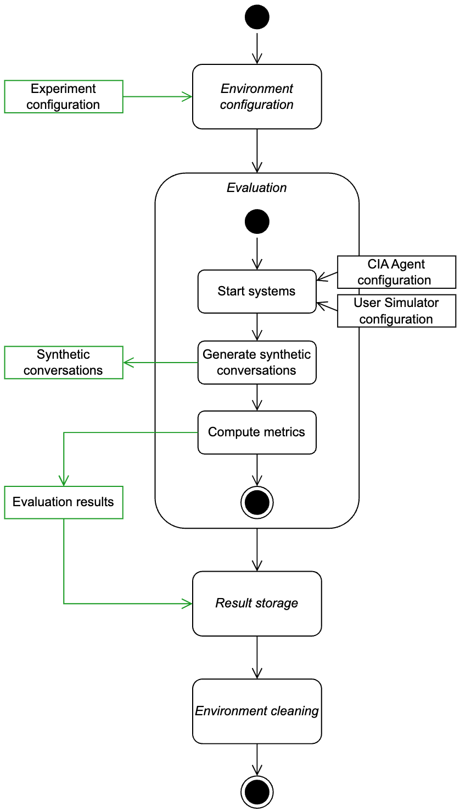

Evaluation framework
====================

The framework includes the definition of the supported tasks and metrics, and the logic to perform simulation-based evaluation. It is designed to be modular and extensible to support diverse evaluation scenarios.

The workflow of the evaluation process is illustrated in the following diagram:

Additional details on implementation can be found in the :doc:`developer documentation <../eval_framework/index>`.