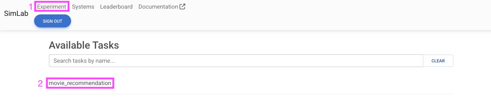
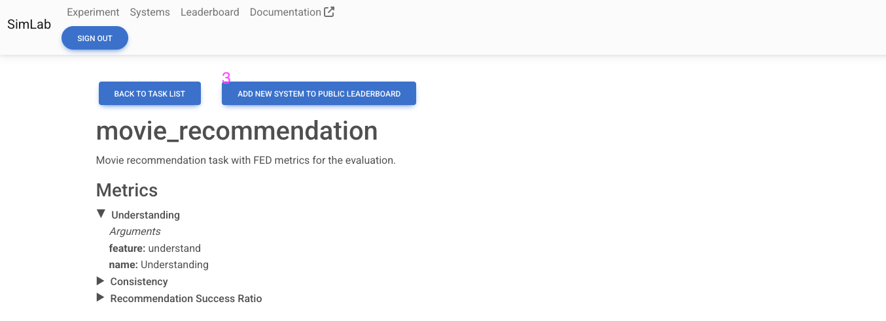
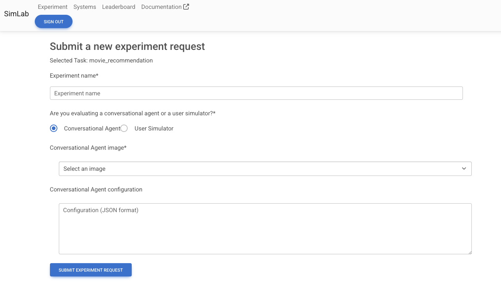

Submit an Experiment Request
============================

An experiment corresponds to a simulation-based evaluation of a set of conversational agents with a set of user simulators with regards to a task and metrics. You have two options to submit an experiment request: (1) using the web application or (2) using the API. The latter will require you to provide a configuration file in JSON format.

If you want to use your own systems, please make sure to add them to SimLab registry first. See the :doc:`add_system_to_registry` guide for more information.

Submit a request using the web application
------------------------------------------

You can submit a request using the web application by following these steps:

1. Go to the `Experiment` page (click on the `Experiment` tab in the navigation bar, see 1 in the image below).
2. Select the task you want to evaluate (see 2 in the image below).

3. Once on the task page, click on the `ADD NEW SYSTEM TO PUBLIC LEADERBOARD` button (see 3 in the image below). Note that you can also see the task's description and its metrics.

4. Fill in the form with the required information. You need to provide an experiment name, the system that you want to evaluate (either a conversational agent or a user simulator), and optionally additional parameters for the selected system in the form of a JSON object.

Submit a request using the API
------------------------------

A script to submit an experiment request using the API is provided in SimLab repository, see `here <https://github.com/iai-group/simlab/blob/demo/scripts/add_baseline_experiment.sh>`_. Note that you need to provide a configuration file in JSON format with the following structure:

.. code-block:: json

    {
        "name": <experiment_name>,
        public: <true|false>,
        "agents": [
            {
                "arguments": {
                    "id": <agent_id>
                },
                "class_name": "WrapperAgent",
                "image": <agent_image>
            },
            ...
        ],
        "user_simulators": [
            {
                "arguments": {
                    "id": <simulator_id>
                },
                "class_name": "WrapperUserSimulator",
                "image": <simulator_image>
            },
            ...
        ],
        "task": <JSON_task_definition>
    }

The `JSON_task_definition` corresponds to the task definition in JSON format. The task definition are available in the folder `data/simlab/tasks` in the SimLab repository. 
